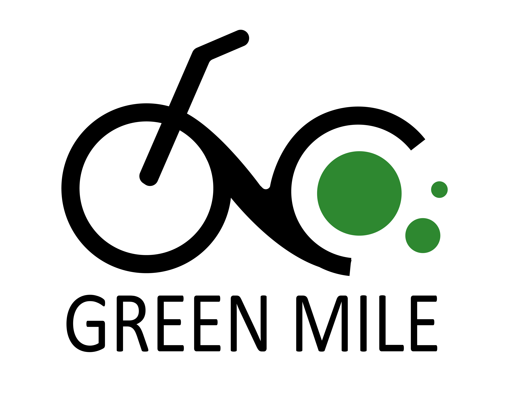

Welcome to the _Green Mile's - Fold a Bike_ GitHub-Page!  

Here you'll find a summary of the work done by Team 6 of the 2021 [Virtual Innovation Challenge](https://www.hm.edu/en/international/projects_1/gxc/gxc_virtual_innovation_challenge.en.html), part of the [Global-X-Changes-Challenges](https://www.hm.edu/en/international/projects_1/gxc/index.en.html) held by the [University of Applied Sciences Munich](https://www.hm.edu/en/index.en.html) and [Deutsche Bahn Connect](https://www.deutschebahnconnect.com/en) (DB).
Members of this team are students from the University of Applied Sciences in Munich or in [Vienna](https://www.fh-campuswien.ac.at/en/index.html). 

# [What is Green Mile's Fold A Bike?]()
*Green Mile's* Fold A Bike App introduces the new and innovative way of traveling and adventuring for your leisure trip by getting rid of troublesome obstacles that would usually slow down or stop your tour and travel experience. By making use of the flexibility and comfortability of the folding bike technology you can take your adventures to the next level.

As indicate by the challenge giver; In a possible cooperation with the most trusted and ingenious folding bike manufacturer - [BROMPTON BICYCLE](https://www.brompton.com/) - we could provide you the perfectly tailored bike for your every desire. May it be a simple sightseeing tour to visit your favorite spots or a hiking trip into the beautiful german mountains, your hunger for exploration knows no boundaries anymore. Simply carry and pack up your folding bike, take it on one of our DB trains, busses, or cars - without additional charge and visit different monuments, cities, or landscapes in the most comfortable and flexible way. 

Train running late? 
 > Just jump on your bike to reach your next stop. 

Trail obstacles on your trip to the mountains? 
> Just pack the bike on your back and keep exploring. No need to stop for any occurrence.

Thanks to our Plan-A-Trip-algorithm, you can create your own tour or a choose from a pre-designed tour. Doing so, you can meet and connect to other travelers, tourers and trippers. Maybe you can undergo a joint journey all together! _Fold A Bike_ guarantees you the most comfortable and unruffled way to enjoy your experience. 

## <b>Don't get stopped! Keep moving! Keep exploring!</b>

# [Unique Selling Point]()
A feature the app contains is supposed to add a further unique attraction and is only indicated but can quickly grow into a whole project itself. The idea is to provide tourists with something of a travelguide app. This guide allows users to swipe (like/dislike) on Point-of-Interests (POIs) and create a tour out of liked POIs. The challenge given connection of train and folding bikes - allows one to scale those tours as wished. Tours can reach from city trips (including or excluding the sourrounding area/landscape) up to full grown adventures, in which the complete country can be easily explored - with a just created tour in the app.  

Depending on the scope the challenge giver wants to set on this feature, it can be extended to a complete social network (amongst folding bike enthusiats). Through this social network further revenue can be generated.  To gain from the network shops, restaurants,... basically any tourist attraction could be charged to be shown frequently in the swipe function or to provide any extra information about their business that they think may be rational. In this community users could interact as contributors. Contributors, who upload POIs or rate visited POIs for example.

Creating a social network is cost intensive, where the costs for developing the app are most likely the biggest investment upfront. Once set up, a social network needs constant maintenance and users ask for support, so the realization depends on the willingness to invest now AND in the future.  

# [Stakeholder]()
When ideating ideas for the given concept, it is imperative to analyse what and how many stakeholders there are involved. This is important because thinking about stakeholders is **essential for an organization to be effective, accountable, and ethical**. 

Other questions to consider in stakeholder interactions include: 
> To what degree do we integrate stakeholders into our decision making?  
> 
> Do we consider both the short- and long-term impacts of our actions on various stakeholder groups? What metrics do we use to track the well-being of our stakeholders?  
> 
> At what level in our organization are these metrics monitored and discussed? What channels do we have to give stakeholders a voice in the formation of our strategy and objectives? 
>
> How willing are we to adapt our approaches and behaviors based on those perspectives?  

In the following diagram you can see an analysis of stakeholders connected to the Green Mile Project and how they interact i.e. what their expectations are.

# Links
[Interactive Prototype](https://github.com/gxc-challenge-winter21/the-green-mile/wiki/Prototype#prototype-of-prototype)  

[GitHub-Wiki](https://github.com/gxc-challenge-winter21/the-green-mile/wiki)
* [Prototype](https://github.com/gxc-challenge-winter21/the-green-mile/wiki/Prototype)  
* [Business Model Canvas](https://github.com/gxc-challenge-winter21/the-green-mile/wiki/Business-Model-Canvas)  
* [Customer Journey](https://github.com/gxc-challenge-winter21/the-green-mile/wiki/Customer_Journey)  
* [Storyboard](https://github.com/gxc-challenge-winter21/the-green-mile/wiki/Storyboard)  

# Team
> Alperen Caygoez (Munich HM)  
> Atila Isa (Munich HM)  
> Hamad Chaudry (Vienna)  
> Sarah Eden Mattitza (Munich HM)  
> Thomas Metzker (Munich HM)  
  
 
  
  
  
  
  
  
  
# To be deleted

